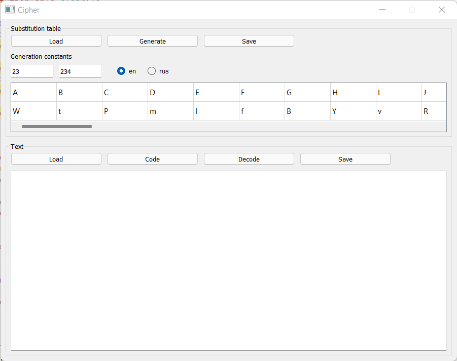
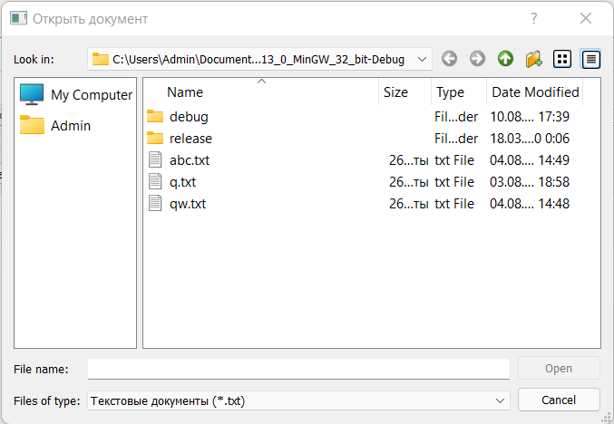

# Substitution Cipher

In cryptography, a substitution cipher is a method of encrypting by which units of plaintext are replaced with ciphertext, according to a fixed system; the "units" may be single letters (the most common), pairs of letters, triplets of letters, mixtures of the above, and so forth. The receiver deciphers the text by performing the inverse substitution.

Before starting encryption, you must select a normative alphabet — a set of characters that will be encrypted (substituted).

The replacement is based on a pre-selected table that acts as an encryption key: each character from the left side of the table is replaced by the corresponding character from the right side of the table.

The disadvantage of the substitution cipher is its weak resistance to cryptanalysis (selection of a key to an encrypted message). The general approach to breaking a substitution cipher is to statistically analyze the ciphertext and compare the resulting statistics with the characteristics of the language in which the original text is written.

# Implementation

This program implements a substitution cipher based on the Qt framework.

The encryption table is formed by the formula:

*E*(*x*) = (*ax* + *b*) mod *m*,

where *x* is the number of the encrypted letter in the alphabet, *m* is the alphabet size, *a* and *b* — encryption key.

We can set the encryption key manually, or it will be generated automatically. We can work with both English and Russian alphabets.

We can also load an existing table or save the generated one (works also for encrypted text).

